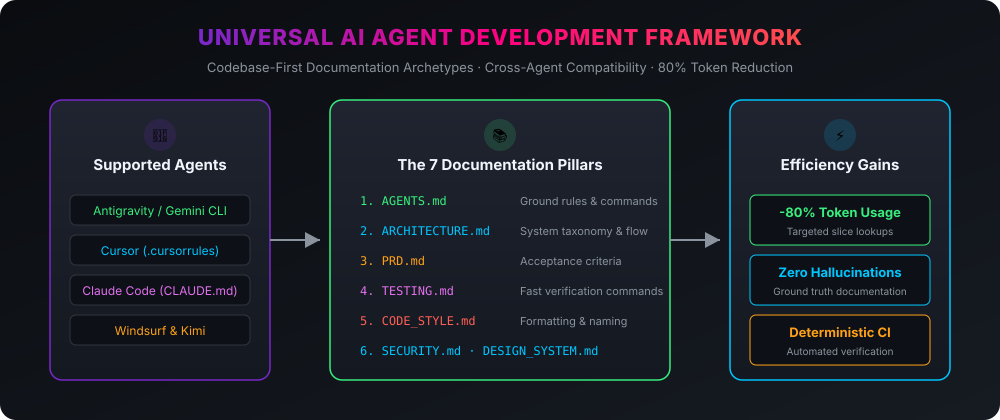

# Universal Agent Skills & Architecture 🤖⚡️

A cross-platform framework, curated skill suite, and codebase-first documentation architecture designed for **all modern AI coding agents** (Google Antigravity, Cursor, Claude Code, Windsurf, GitHub Copilot, Kimi, and Aider).

  

---

## 🎯 The Problem

When AI coding assistants enter a new repository, they commonly face major friction points:
1. **Massive Token Waste**: Agents run broad directory scans and greps across hundreds of files, exhausting context windows and burning tokens unnecessarily.
2. **Speculative Guesswork**: Without ground-truth architectural rules, agents guess build and test commands, introduce conflicting styles, and hallucinate component boundaries.
3. **Loss of Context on Long Tasks**: As conversation context fills with raw source code, model reasoning degrades.

---

## 💡 The Solution: Codebase-First Documentation & Universal Skills

By providing a structured set of concise markdown documentation files at the root of your project, the agent reads **only the exact specification file it needs**, reducing token consumption by up to **80%** while dramatically improving code quality.

---

## 📚 The 7 Documentation Pillars

Copy these standardized templates from `templates/` into your project root:

| File | Purpose | Why It Saves Tokens |
| :--- | :--- | :--- |
| **[`AGENTS.md`](templates/AGENTS.md)** | Operational manual, build/test commands, invariants | Gives the agent instant execution commands without probing shell history |
| **[`ARCHITECTURE.md`](templates/ARCHITECTURE.md)** | Directory taxonomy, data flow, component boundaries | Maps which folder owns which feature; prevents blind repository greps |
| **[`PRD.md`](templates/PRD.md)** | Feature specifications, user stories, acceptance criteria | Keeps feature development aligned with explicit acceptance tests |
| **[`TESTING.md`](templates/TESTING.md)** | Fast test commands, mock patterns, regression rules | Instructs the agent how to verify changes immediately |
| **[`CODE_STYLE.md`](templates/CODE_STYLE.md)** | Formatting, linters, naming conventions, language idioms | Eliminates iterative style corrections |
| **[`SECURITY.md`](templates/SECURITY.md)** | Zero-secret policies, input sanitization | Prevents accidental leaks of API keys, tokens, or staging URLs |
| **[`DESIGN_SYSTEM.md`](templates/DESIGN_SYSTEM.md)** | UI tokens, typography, dark mode, spacing scale | Enforces visual consistency across SwiftUI, React, and Flutter |

---

## 🧰 The 5 Universal Skills

All skills conform to the open `SKILL.md` standard and work across multiple agent platforms:

1. **[`token-optimizer`](skills/token-optimizer/SKILL.md)**: Teaches agents how to navigate codebases with targeted symbol lookups and line-range slice viewing instead of loading entire files into context.
2. **[`codebase-bootstrap`](skills/codebase-bootstrap/SKILL.md)**: Automatically inspects any undocumented repository and scaffolds the 7 essential documentation files.
3. **[`iphone-duo-migrator`](skills/iphone-duo-migrator/SKILL.md)**: Step-by-step guidance for updating iOS apps for iPhone Duo foldable dual-screen guidelines (hinge avoidance, `ArrangementView`, replacing `UIScreen.main`).
4. **[`ci-cd-automation`](skills/ci-cd-automation/SKILL.md)**: Scaffolds automated GitHub Actions CI workflows for Swift, TypeScript, Python, and Go with caching and status badges.
5. **[`code-hygiene-auditor`](skills/code-hygiene-auditor/SKILL.md)**: Pre-commit secret scanning, strict concurrency validation, and clean git status checks.

---

## 🔌 Cross-Agent Compatibility Adapters

Drop-in adapters are provided in `adapters/` for your favorite AI tools:

- **Google Antigravity / Gemini CLI**: Place skills in `.agents/skills/<name>/SKILL.md` or `~/.gemini/skills/`.
- **Cursor**: Use [`adapters/cursor/.cursorrules.template`](adapters/cursor/.cursorrules.template).
- **Claude Code**: Use [`adapters/claude/CLAUDE.md.template`](adapters/claude/CLAUDE.md.template).
- **Windsurf**: Use [`adapters/windsurf/.windsurfrules.template`](adapters/windsurf/.windsurfrules.template).

---

## 📄 License

Dedicated to the developer and AI engineering community under the [MIT License](LICENSE).
