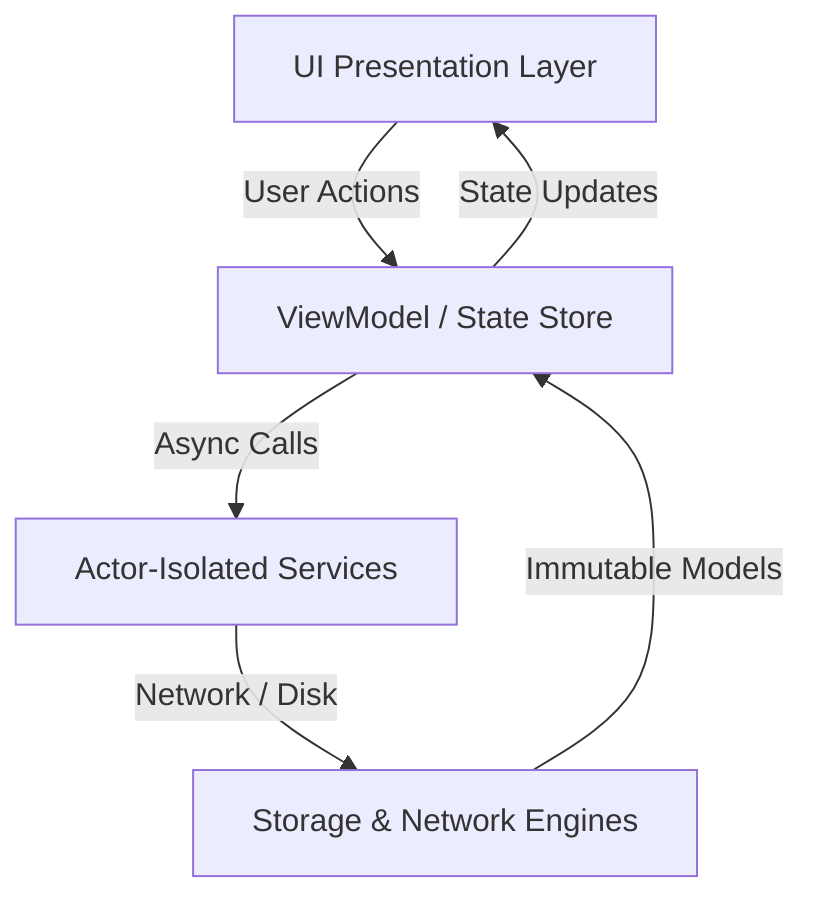

# Codebase Bootstrap (Automated Architecture Scaffolding) 🏗️📚

The definitive operational manual for AI coding agents tasked with ingesting undocumented or legacy repositories, discovering build invariants, analyzing structural taxonomy, and scaffolding the 7 standardized documentation pillars that make codebases permanently agent-friendly.

---

## 1. Executive Summary & Core Philosophy

When an AI coding assistant enters an unmapped repository, it typically spends excessive tokens probing shell commands, guessing build tools, and making unverified assumptions. By bootstrapping the 7 standardized documentation pillars, the agent provides ground-truth operating instructions for itself and future agents.

### Failure Modes of Naive Agents
1. **Speculative Probing**: Running blind directory scans and greps across hundreds of files without checking for existing manifest files.
2. **Missing Ground-Truth Commands**: Writing generic README documentation that omits executable, verified shell commands for building and testing.
3. **Monorepo Boundary Confusion**: Overlooking multi-package or monorepo boundaries, creating conflicting root configurations that break child projects.
4. **Ignoring Hidden Conventions**: Failing to inspect existing linters (`.swiftlint.yml`, `.eslintrc`, `ruff.toml`) or CI workflows (`.github/workflows/`), leading to inconsistent code style suggestions.

### The Bootstrapper's Mandate
- **Rule 1 (Inspect Manifests First)**: Never guess a project's stack. Inspect root and subfolder manifests (`Package.swift`, `package.json`, `Cargo.toml`, `go.mod`, `pyproject.toml`, `Makefile`) to identify the toolchain with 100% certainty.
- **Rule 2 (Executable Invariants)**: Every `AGENTS.md` generated MUST contain real, tested build, test, and run commands verified against the local environment.
- **Rule 3 (Structural Mapping)**: Every `ARCHITECTURE.md` MUST provide a concrete directory tree and document which folder owns which responsibility.
- **Rule 4 (Zero Artificial Padding)**: All generated documentation must contain concrete, domain-specific information, not generic placeholders.

---

## 2. Technology Stack Auto-Detection Protocol

Execute this detection sequence upon entering any undocumented repository:

```bash
# Step 1: Detect package manifests and build systems
find . -maxdepth 2 \( \
  -name "Package.swift" -o \
  -name "*.xcodeproj" -o \
  -name "*.xcworkspace" -o \
  -name "package.json" -o \
  -name "Cargo.toml" -o \
  -name "pyproject.toml" -o \
  -name "requirements.txt" -o \
  -name "go.mod" -o \
  -name "Makefile" -o \
  -name "docker-compose.yml" -o \
  -name "pubspec.yaml" \
\) -not -path "*/.*" -not -path "*/node_modules/*"
```

### Detection Matrix & Command Extraction

| Manifest File | Detected Technology | Command Discovery Target | Primary Fast Test Command |
| :--- | :--- | :--- | :--- |
| `Package.swift` | Swift / Apple Package | Inspect `targets` and `dependencies` | `swift test -v` |
| `*.xcodeproj` / `*.xcworkspace` | Xcode Application (iOS/macOS) | Inspect shared schemes in `xcshareddata` | `xcodebuild test -scheme <Scheme> -destination 'platform=macOS' CODE_SIGNING_ALLOWED=NO` |
| `package.json` | Node.js / TypeScript / React | Inspect `scripts` object in `package.json` | `npm test` or `pnpm test` or `bun test` |
| `pyproject.toml` | Python (Modern) | Inspect `[tool.pytest]`, `[tool.poetry]` | `pytest -v` |
| `requirements.txt` | Python (Legacy) | Inspect virtualenv and test framework | `pytest` or `python -m unittest` |
| `Cargo.toml` | Rust | Inspect `[[bin]]` and `[dependencies]` | `cargo test` |
| `go.mod` | Go | Inspect module path and Go version | `go test -v ./...` |
| `pubspec.yaml` | Flutter / Dart | Inspect `dependencies` and SDK constraints | `flutter test` |
| `Makefile` | Polyglot / Systems | Inspect `test:`, `build:`, `lint:` targets | `make test` |
| `docker-compose.yml` | Multi-Container Stack | Inspect `services:` and healthchecks | `docker compose ps` / `docker compose up -d` |

---

## 3. The 7 Documentation Pillars Specification

Every bootstrapped project should contain these 7 standardized documentation files:

```
project-root/
├── AGENTS.md               # 1. Operational manual for AI agents (build/test/run commands)
├── ARCHITECTURE.md         # 2. Directory taxonomy, module boundaries, data flow diagrams
├── PRD.md                  # 3. Product requirements, user stories, acceptance criteria
├── TESTING.md              # 4. Fast unit test commands, mock patterns, regression rules
├── CODE_STYLE.md           # 5. Formatting, linters, naming conventions, language idioms
├── SECURITY.md             # 6. Zero-secret policies, sanitization, credential handling
└── DESIGN_SYSTEM.md        # 7. UI tokens, typography, dark mode, spacing scales
```

---

## 4. Production-Grade Templates for the 7 Pillars

### Pillar 1: Production `AGENTS.md` Template

````markdown
# AGENTS.md

Operational manual and ground-truth invariants for AI coding assistants working on this repository.

## 1. Project Overview
- **Name**: [Project Name]
- **Platform**: [e.g. macOS 14+, iOS 16+, Node 20+, Python 3.11+]
- **Architecture**: [e.g. Swift Package, Next.js App Router, FastAPI Microservice]

## 2. Verified Execution Commands
Commands must be run from the repository root:

- **Build**:
  ```bash
  [e.g. swift build -v / npm run build / cargo build]
  ```
- **Fast Test (Run after every edit)**:
  ```bash
  [e.g. swift test --filter <Target> / npm test -- --watch=false / pytest tests/unit]
  ```
- **Lint & Format**:
  ```bash
  [e.g. swiftlint / npm run lint / ruff check .]
  ```

## 3. Critical Invariants
- Invariant 1: [e.g. Zero external dependencies beyond standard library]
- Invariant 2: [e.g. Strict concurrency enabled: all types crossing actor boundaries must be Sendable]
- Invariant 3: [e.g. Zero secrets: all credentials must use .env.example placeholders]

## 4. Verification Protocol
Before marking any task complete:
1. Run the fast test command and verify 100% green pass.
2. Verify `git status` has zero untracked artifacts or modified files outside scope.
3. Check compiler output for zero warnings.
````

---

### Pillar 2: Production `ARCHITECTURE.md` Template

````markdown
# ARCHITECTURE.md

Directory taxonomy, module boundaries, and data flow architecture.

## 1. Directory Structure
```text
Sources/
├── Models/              # Immutable data structures, DTOs, domain entities
├── Services/            # Business logic, actors, network clients, storage engines
├── UI/                  # Presentation layer, views, view models, design tokens
└── Utilities/           # Thread-safe primitives, extensions, logging helpers
Tests/
├── UnitTests/           # Fast, deterministic isolated tests (< 2s execution)
└── MockFixtures/        # In-memory test fixtures and protocol stubs
```

## 2. Component Boundaries & Data Flow


## 3. Module Ownership Rules
- `Models/` must never import UI frameworks (`SwiftUI`, `UIKit`, `React`).
- `Services/` must be decoupled from UI lifecycle and isolated to custom actors.
- `UI/` must observe state through view models or observable stores; never instantiate raw network clients directly inside views.
````

---

### Pillar 3: Production `PRD.md` Template

````markdown
# PRD.md — Product Requirements Document

## 1. Problem Statement
Describe the core user problem this software solves.

## 2. Target Audience & Personas
- **Primary Persona**: [e.g. iOS Engineers, Self-Hosters, Mobile App Users]
- **Core Need**: [e.g. Fast document scanning without cloud dependency]

## 3. Functional Requirements (User Stories)
- **US-01**: As a user, I want to scan documents offline so that my private data never leaves my device.
  - *Acceptance Criteria*: Processing takes < 200ms on Apple Silicon; outputs searchable PDF.
- **US-02**: As a user, I want biometric locking so that unauthorized users cannot view my documents.
  - *Acceptance Criteria*: Face ID / Touch ID prompt triggers on app backgrounding; fallback to Keychain PIN.

## 4. Non-Functional Requirements
- **Performance**: Launch time < 400ms; memory footprint < 60MB.
- **Privacy**: Zero analytics tracking; zero third-party telemetry.
- **Reliability**: Graceful offline degradation; zero crash tolerance.
````

---

### Pillar 4: Production `TESTING.md` Template

````markdown
# TESTING.md

Testing conventions, test suites, and mock patterns.

## 1. Fast Test Execution
Run unit tests locally before pushing:
```bash
[Test command, e.g. swift test --parallel / npm test]
```

## 2. Testing Philosophy
- **Deterministic**: Tests must never rely on real network connections or `Task.sleep` delays.
- **Isolated**: Every test must run independently without shared mutable state.
- **Fast**: The unit test suite must execute in under 5 seconds.

## 3. Mocking Patterns
Always use protocol-based stubs or `URLProtocol` interception:
```swift
// Example Protocol Stub
protocol NetworkSessionProtocol: Sendable {
    func data(from url: URL) async throws -> (Data, URLResponse)
}

final class MockNetworkSession: NetworkSessionProtocol {
    var stubbedData: Data = Data()
    func data(from url: URL) async throws -> (Data, URLResponse) {
        let response = HTTPURLResponse(url: url, statusCode: 200, httpVersion: nil, headerFields: nil)!
        return (stubbedData, response)
    }
}
```
````

---

### Pillar 5: Production `CODE_STYLE.md` Template

````markdown
# CODE_STYLE.md

Formatting standards, linters, naming conventions, and language idioms.

## 1. Naming Conventions
- **Types**: PascalCase (`DocumentScanner`, `UserProfile`)
- **Functions & Variables**: camelCase (`fetchUserProfile`, `activeSession`)
- **Constants**: camelCase (`maximumRetryCount`, `defaultTimeout`)
- **Protocols**: Adjectives or nouns ending in -able or -Protocol (`Sendable`, `SyncEngineProtocol`)

## 2. Formatting & Linters
- Indentation: 4 spaces (Swift, Python) / 2 spaces (TypeScript, YAML)
- Max line length: 120 characters
- Trailing commas in multi-line lists/arrays
- Linter invocation:
  ```bash
  [Lint command, e.g. swiftlint --strict / npm run lint / ruff check .]
  ```

## 3. Idiomatic Rules
- Prefer value types (`struct`, `enum`) over reference types (`class`) unless identity or reference sharing is required.
- Handle all errors explicitly with custom error enums conforming to `Error` and `LocalizedError`.
- Never use force unwrap (`!`) in production code paths; use `guard let` or `if let`.
````

---

### Pillar 6: Production `SECURITY.md` Template

````markdown
# SECURITY.md

Security policies, secret management, and vulnerability reporting.

## 1. Zero-Secret Policy
- Never commit real API keys, passwords, private tokens, or staging URLs.
- Always provide a sanitized `.env.example` file with placeholder values.
- Verify that `.env` and `.env.local` are listed in `.gitignore`.

## 2. Pre-Commit Secret Scanning
Run before every commit:
```bash
git grep -nE "(ghp_[a-zA-Z0-9]{36}|sk-[a-zA-Z0-9]{32,}|AKIA[0-9A-Z]{16})" || echo "No secrets found"
```

## 3. Vulnerability Reporting
To report a security vulnerability, please email security@[domain] rather than opening a public issue.
````

---

### Pillar 7: Production `DESIGN_SYSTEM.md` Template

````markdown
# DESIGN_SYSTEM.md

Visual design tokens, typography scales, colors, and layout geometry.

## 1. Color Palette
- **Primary Accent**: `#38bdf8` (Cyan / Sky Blue)
- **Background (Dark)**: `#0a0c10`
- **Surface Card (Dark)**: `#141b26` with border `#1e293b`
- **Text Primary**: `#f8fafc`
- **Text Muted**: `#94a3b8`

## 2. Typography Scale
- **Display Large**: 32pt / Bold / Rounded
- **Headline**: 20pt / SemiBold
- **Body**: 15pt / Regular
- **Caption / Footnote**: 12pt / Medium

## 3. Touch Targets & Spacing
- Minimum touch target: 44×44 pt (Apple HIG compliant)
- Standard margins: 16pt (Mobile) / 24pt (Tablet / Desktop)
- Standard corner radius: 12pt (Cards) / 8pt (Buttons) / 999pt (Pills)
````

---

## 5. Real-World Stack Scaffolding Case Studies

### Case Study 1: Swift Package Manager Library (SPM)
- **Detected Manifest**: `Package.swift`
- **Agent Actions**:
  1. Parse targets in `Package.swift` to identify library name (`Sources/MyLib`) and test target (`Tests/MyLibTests`).
  2. Test execution: verify `swift test` runs cleanly.
  3. Generate `AGENTS.md` with:
     ```bash
     swift build
     swift test -v
     ```
  4. Generate `ARCHITECTURE.md` showing `Sources/` and `Tests/` mapping.

### Case Study 2: Next.js + Tailwind + TypeScript Web Application
- **Detected Manifest**: `package.json` containing `"next"`, `"tailwindcss"`, `"typescript"`
- **Agent Actions**:
  1. Inspect `package.json` scripts: `"dev"`, `"build"`, `"lint"`.
  2. Verify if `pnpm-lock.yaml`, `yarn.lock`, or `package-lock.json` exists to select correct package manager.
  3. Generate `AGENTS.md` with:
     ```bash
     npm run build
     npm run lint
     npm test
     ```
  4. Scaffold `DESIGN_SYSTEM.md` by inspecting `tailwind.config.js`.

### Case Study 3: Python / FastAPI Backend Microservice
- **Detected Manifest**: `pyproject.toml` or `requirements.txt` containing `"fastapi"`, `"uvicorn"`
- **Agent Actions**:
  1. Identify test runner: inspect for `pytest` in dependencies.
  2. Identify linter: inspect for `ruff` or `flake8`.
  3. Generate `AGENTS.md` with:
     ```bash
     pytest tests/ -v
     ruff check .
     uvicorn main:app --reload
     ```
  4. Generate `SECURITY.md` documenting `.env.example` usage for database connection strings.

### Case Study 4: Multi-Container Docker Compose Stack
- **Detected Manifest**: `docker-compose.yml`
- **Agent Actions**:
  1. Parse `services:` block to identify database (Postgres/Redis), API, and frontend containers.
  2. Verify healthcheck declarations.
  3. Generate `AGENTS.md` with:
     ```bash
     docker compose up -d
     docker compose ps
     docker compose logs -f api
     ```
  4. Scaffold `ARCHITECTURE.md` with a Mermaid container topology diagram.

---

## 6. Monorepo Bootstrapping Protocol

When a repository contains multiple sub-projects (e.g. `apps/ios/`, `apps/web/`, `packages/shared/`):

1. **Root `AGENTS.md`**:
   - Provide high-level navigation mapping to child projects.
   - List workspace-wide orchestration commands (e.g. `pnpm run build --filter ...`).
2. **Per-Package `AGENTS.md`**:
   - Place localized `AGENTS.md` in each package directory containing exact, package-specific build and test commands.
3. **Monorepo `ARCHITECTURE.md`**:
   - Explicitly define inter-package dependency relationships (e.g. `apps/web` depends on `packages/shared`, but never vice-versa).

---

## 7. Operational Verification Checklist

Before considering a codebase bootstrapping task complete:

- [ ] Every generated `AGENTS.md` contains executable build and test commands verified in the local terminal.
- [ ] `ARCHITECTURE.md` accurately reflects the real directory tree and component boundaries.
- [ ] `SECURITY.md` exists and `.env.example` has been created if the project uses environment variables.
- [ ] No generated documentation contains duplicate filler, placeholder loops, or synthetic padding.
- [ ] All 7 pillars are formatted in standard, readable GitHub-flavored markdown.