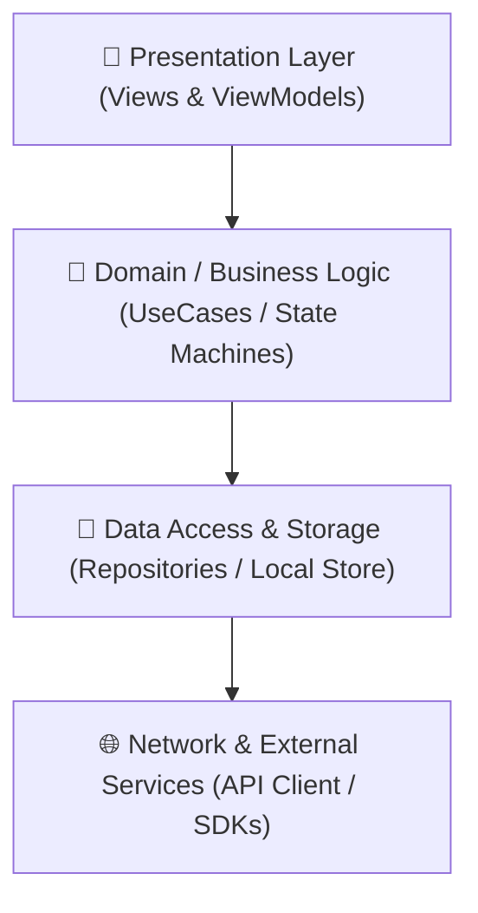

# ARCHITECTURE.md — System Taxonomy & Component Boundaries

> This document defines the structural architecture, component responsibilities, and data flow.
> Agents should read this file to understand where specific logic lives before opening source files.

---

## 🏗️ High-Level Architecture Diagram

---

## 📂 Directory Taxonomy

| Directory Path | Architectural Responsibility | Key Interfaces / Exports |
| :--- | :--- | :--- |
| `Sources/App/` | Application entry point & lifecycle management | App Delegate, Main Scene |
| `Sources/Core/` | Domain models, protocols, and pure business logic | Entities, UseCases |
| `Sources/UI/` | Reusable views, design tokens, screens | SwiftUI Views, Modifiers |
| `Sources/Data/` | Persistence, networking, and external adapters | Repositories, API Clients |
| `Tests/` | Unit, integration, and UI test suites | XCTest / Jest / PyTest |

---

## 🔄 Core Data Flow & State Management

1. **Unidirectional Data Flow**: State flows down into views; events and user actions bubble up through coordinators/view models.
2. **Side Effect Isolation**: All asynchronous operations, disk I/O, and network requests are isolated into background actors or services.
3. **Dependency Injection**: Dependencies are injected through protocols to ensure testability without mocks spinning up real network sockets.
